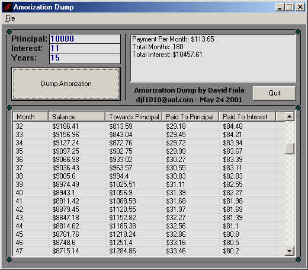



## Amorization Dump \- Amorization Calculator

### Description

This app. shows you how much your payments will be on a loan, then using amorization builds a table that displays how much each month goes to interest,and principal.
 
### More Info
 
All you need to do is put in your principal,interest rate, and how many years.

Theres nothing to be assumed about it. Even if your not planning on getting a loan its cool to know how much actually goes to interest.

It returns: Total months,payment per month,how much total goes to interest, and a full amorization table.

No side effects

             |
---                |---
**Submitted On**   |2001-05-24 10:03:14
**By**             |[Close\_Account](https://github.com/Planet-Source-Code/PSCIndex/blob/master/ByAuthor/close-account.md)
**Level**          |Advanced
**User Rating**    |5.0 (30 globes from 6 users)
**Compatibility**  |VB 3\.0, VB 4\.0 \(16\-bit\), VB 4\.0 \(32\-bit\), VB 5\.0, VB 6\.0
**Category**       |[Complete Applications](https://github.com/Planet-Source-Code/PSCIndex/blob/master/ByCategory/complete-applications__1-27.md)
**World**          |[Visual Basic](https://github.com/Planet-Source-Code/PSCIndex/blob/master/ByWorld/visual-basic.md)
**Archive File**   |[Amorizatio199995242001\.zip](https://github.com/Planet-Source-Code/close-account-amorization-dump-amorization-calculator__1-23402/archive/master.zip)

### API Declarations

All in ZIP.

